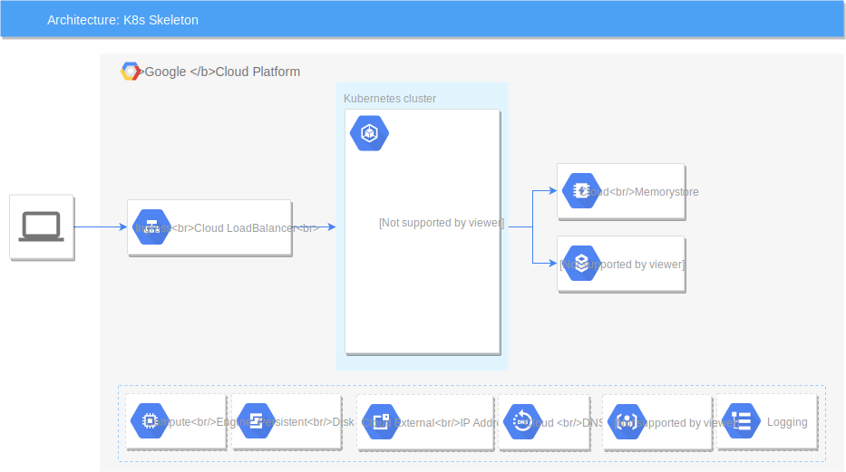

# kubernetes skeleton


## 1. Create sql and redis instances
#### Cloud SQL and REDIS
  ```bash
  gcloud init;
  export PROJECT="$(gcloud config get-value project)";
  export REGION="us-east1";
  export ZONE="${REGION}-b";
  export SQL_NAME="k8-sql";
  export SQL_PASS="my_db_secret"; # << CHANGE
  export REDIS_NAME="k8-redis";

  # create sql instance
  gcloud beta sql instances create "${SQL_NAME}" --zone="${ZONE}" --project="${PROJECT}" --root-password="${SQL_PASS}" --no-assign-ip --network="default";
  # add external ingress
  gcloud beta sql instances patch "${SQL_NAME}" --assign-ip --project="${PROJECT}" --authorized-networks=$(curl ipinfo.io/ip) -q;
  # get internal sql ip
  gcloud sql instances describe "${SQL_NAME}" --project="${PROJECT}" | grep -B1 -ne "type: PRIVATE" | grep -ne "ipAddress" | awk -F ': ' '{print($2)}';
  # get external ip
  gcloud sql instances describe "${SQL_NAME}" --project="${PROJECT}" | grep -B1 -ne "type: PRIMARY" | grep -ne "ipAddress" | awk -F ': ' '{print($2)}';

  # create redis instance
  gcloud redis instances create "${REDIS_NAME}" --region="${REGION}" --project="${PROJECT}";
  # get ip
  gcloud redis instances describe "${REDIS_NAME}" --region="${REGION}" --project="${PROJECT}" | grep host | awk -F ':' '{print($2)}';

  # populate sql
  export SQL_IP="$(gcloud sql instances describe ${SQL_NAME} --project=${PROJECT} | grep -B1 -ne "type: PRIMARY" | grep -ne "ipAddress" | awk -F ': ' '{print($2)}')";
  mysql -u "root" -h "${SQL_IP}" -p"${SQL_PASS}" < "./k8_serv_js/items.sql";

  # create local images
  docker-compose up;
  # stop [ctrl + c]

  ```

## 2. Deploy
> **Note:** Edit **deploy.sh** and change DB connection (SQL|REDIS: ips, user, pass...)
```bash
# test app and build images
bash deploy.sh;
```

## 3. Review app

```bash
IP_INGRESS="$(kubectl get ingress | grep k8-app-ingress | awk -F ' ' '{print($3)}')";
# sql query
curl -X GET "http://${IP_INGRESS}/sql/?limit=5";

# redis
curl -X GET "http://${IP_INGRESS}/redis/";

# stress test
#curl -X GET "http://${IP_INGRESS}/?sleep=10&&cpus=5";
for i in {1..220};do curl -k "http://${IP_INGRESS}/?sleep=3&cpus=4&date=$(date -u '+%Y-%m-%d_%H:%M:%S.%N')-$i" & date;done;

```


> Note: Crate Register A to External IP 

#### 6.1.0 Deploy backend (optional)
> If you want change timeout LoadBalancer interconnection, you will have that implements backend config "k8_app_ingress_backendconfig.yaml" and add anotations in each service "k8_app_py_service.yaml"
```bash
# deploy ingress
kubectl apply -f kubernetes_files/kubernetes_files/k8_app_ingress_backendconfig.yaml;
# re-deploy service
kubectl apply -f kubernetes_files/kubernetes_files/k8_app_py_service.yaml;
```

### 6.2 Create certs let's encrypt
```bash
# create alias command
alias cerbot="docker run --rm -it -p 443:443 -v ${HOME}/cerbot:/etc/letsencrypt -v ${HOME}/cerbot/log:/var/log/letsencrypt quay.io/letsencrypt/letsencrypt:latest";

# create ssl
cerbot certonly --manual -d ${DOMAIN};
```

- Complete info and wait for uri confirmation...
- Change the value for enviroment variable 'RESPONSE' with rw response need in kubernetes file 'k8_letsencrypt_res.yaml'.
- Deploy to kubernetes 

```bash
# deploy let's encrypt response
kubectl apply -f kubernetes_files/k8_letsencrypt_res.yaml;
```

- Continue with validation
- Deploy ssl to kubernetes secrets 


### 6.3 deploy keys
```bash
# set vars
DOMAIN_SSL="${HOME}/cerbot/archive/${DOMAIN}/";

# add permissions
sudo chown -R $(whoami):$(whoami) "${HOME}/cerbot";

# Deploy to kubernetes 
kubectl create secret generic k8-app-ssl-secrets --from-file=${DOMAIN_SSL}/cert1.pem --from-file=${DOMAIN_SSL}/privkey1.pem --from-file=${DOMAIN_SSL}/chain1.pem;

# get base64 secrets
kubectl get secrets k8-app-ssl-secrets -o yaml;
```

- Edit "k8_app_ssl_secrets.yaml" and change values for base64 value:
    - **tls.crt** = (value = cert1.pem)
    - **tls.key** = (value = privkey1.pem)
```yaml
data:
  - tls.crt = LS0tLS1CRUdJTiBDRVJUSUZJQ0FURS0t...
  - tls.key = LS0tLS1CRUdJTiBQUklWQVRFIEtFWS0t...
```

- Deploy "k8_app_ssl_secrets.yaml"
```bash
kubectl apply -f kubernetes_files/k8_app_ssl_secrets.yaml;
```

- Edit "k8_app_ingress.yaml" add tls data:
```yaml
spec:
  tls:
  - hosts:
    - ${DOMAIN}
    secretName: k8-app-ssl-secrets
```
- Deploy "k8_app_ingress.yaml"
```bash
kubectl apply -f kubernetes_files/k8_app_ingress.yaml;
```

## a. Utils

### a.1 Kubernetes commands
#### a.1.1 update only pod image
```bash
kubectl set image deployment k8-app-py-deployment "k8-app-py-container=gcr.io/${PROJECT}/k8_app_py:${VERSION_PY}";
```

#### a.1.2 set manual command autoscaling
```bash
kubectl autoscale deployment k8-app-py-deployment --min=3 --max=7 --cpu-percent=80;
# query
kubectl get hpa;
```

#### a.1.3 rollout
```bash
kubectl rollout history deployment k8-app-py-deployment;
kubectl edit deployment k8-app-py-deployment;
kubectl rollout status deployment k8-app-py-deployment;
```

#### a.1.4 curl to scaling
- First pos is scaling, later nodes is scaling

```bash
HOST='http://35.244.246.126:8080';
for i in {1..220};do curl -k "${HOST}/?sleep=3&cpus=4&date=$(date -u '+%Y-%m-%d_%H:%M:%S.%N')-$i" & date;done;
```

### a.2 Minikube
- Minicube ([install](https://kubernetes.io/docs/tasks/tools/install-minikube/) | [doc](https://kubernetes.io/docs/setup/minikube/#minikube-features))

### a.2.1 start/stop
```bash
# start
minikube start;
 
# stop
minikube stop;
```

### a.2.2 vincule docker
```bash
eval $(minikube docker-env);
```
